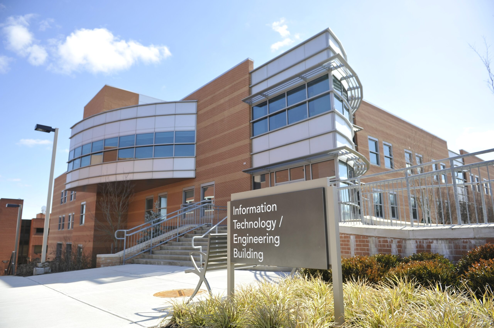

<!DOCTYPE html>
<html>
<head>

<body>

<h1>UMBC Information Systems</h1>

 
<section>
  <h1>Welcome!</h1>
  
Welcome to the UMBC Department of information systems. Our program helps students prepare for the business and IT world.  

</section>

<section>
  <h1>Key Information</h1>
  
To find out more about our Information Systems program, please contact us or look at our program to find out more by clicking the links below

</section>
 
<a href="underis.html" target="_blank">Under Grad Program</a>
<a href="contact.html" target="_blank">Contact Us</a>

